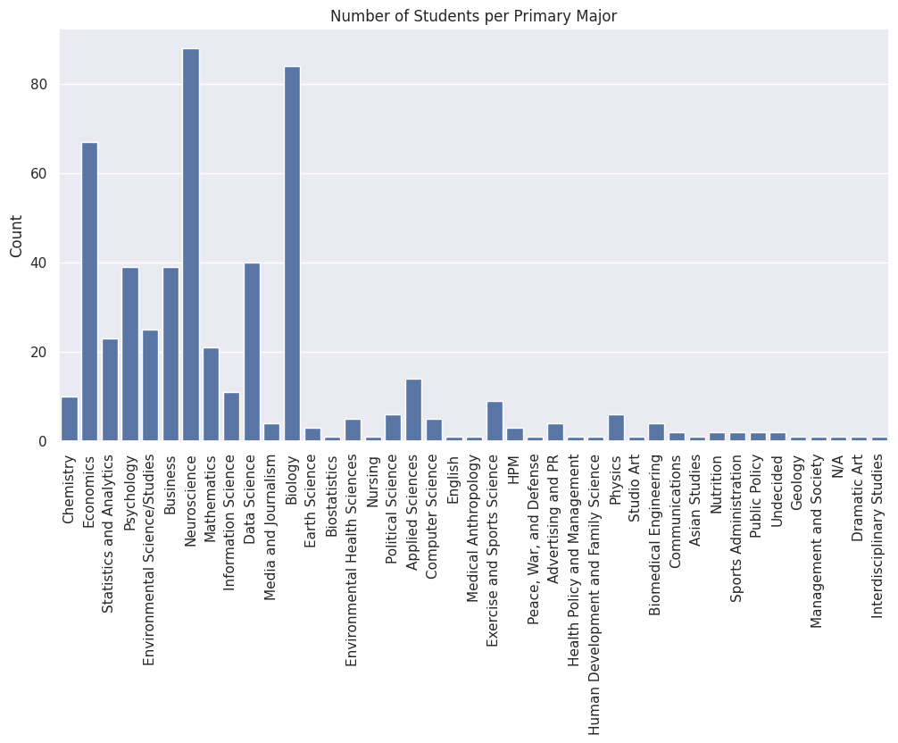
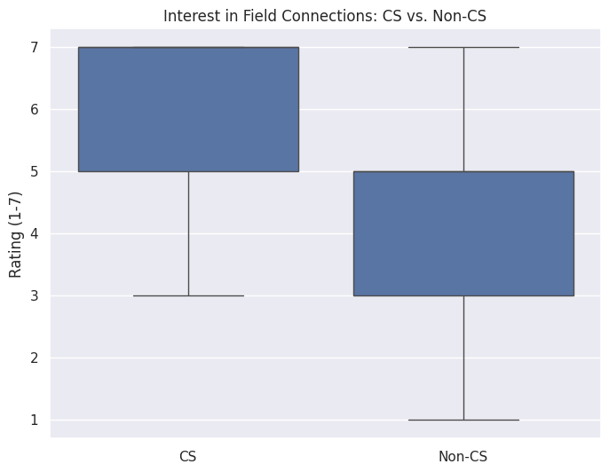
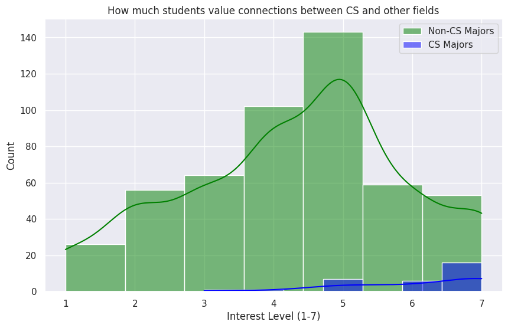

---
# Do not edit the text between these lines!
layout: default
---

# Data Analysis: COMP110 and Interdisciplinary Applications

<!-- This is a comment. Below, you'll see code for inserting an image. To make this image appear, update <custom-path>. To add an image, save it inside the imgs folder of this repository. -->

## Summary

This course should provide examples of applications in other fields because it will emphasize practicality for students who are not computer science majors. 

The goal of this project is to determine if students from non-Computer Science backgrounds, a large portion of the student population, would find more value in the course if examples were drawn from other fields (psychology, business, etc.). 

Our analysis included:
Converting raw row-oriented survey data into a columnar format for easier manipulation.
Grouping students into "CS Majors" and "Non-CS Majors" based on their intended major and intention to major in CS (comp_major). 
Analyzing Likert-scale responses (1-7) relating to student interest in the connections between computer science and other fields. 

## Visualizations and Data Findings
Below are the three key visualizations generated from the survey_izzi.csv dataset.

### Visualization 1: Number of Students per Primary Major
This bar chart illustrates the wide variety of primary majors currently enrolled in COMP110. It highlights that the "Non-CS" stakeholder group is large and academically diverse. 

### Visualization 2: Interest Comparison (CS vs. Non-CS)
I then compared the "Interest in Field Connections" ratings between CS and Non-CS students. The box plot shows that Non-CS students have a very high median interest in seeing these connections. 

### Visualization 3: Density of Student Interest 
The histogram shows the density of student ratings. A large group of students, particularly non-majors, provided ratings of 5, 6, or 7, indicating a strong desire for practical, interdisciplinary applications. 

## Conclusion
Based on the analysis of the COMP110 survey data (specifically survey_izzi), our idea that the course should provide examples of applications in other fields to support learning is strongly supported by the data.

The analysis shows a high level of interest in the connections between computer science and other fields across all students. 

Both Computer Science majors and Non-CS majors reported high scores in the interested_connections column, a significant number of students providing ratings of 4-7. 

The primary_major distribution showed a very large variety of academic backgrounds (Biology, Economics, Psychology, Media/Journalism, etc.). The box plot also indicated that Non-CS majors had an average belief in connecting different fields while CS majors have a high interest. 

We recommend that in the future, the course can try to include at least one interdisciplinary example into each major module. For example, instead of focusing on purely tech-focused examples, the course could use a dataset from public policy or neuroscience. The course could also implement having a "select your coding exercise" where the programming logic is the same, but students can choose a "theme" (healthcare, finance, etc.) so that the information is most relevant to them. 

This change does have some potential costs as creating these examples requires more time and effort from instructors and TAs both to integrate and confirm. Adding in different field examples could also confuse some students, making things more complicated. 

However, ultimately, with the large number of non-CS majors taking this course, we think that it would be helpful to integrate our suggestion so that the course is more engaging and practical. 